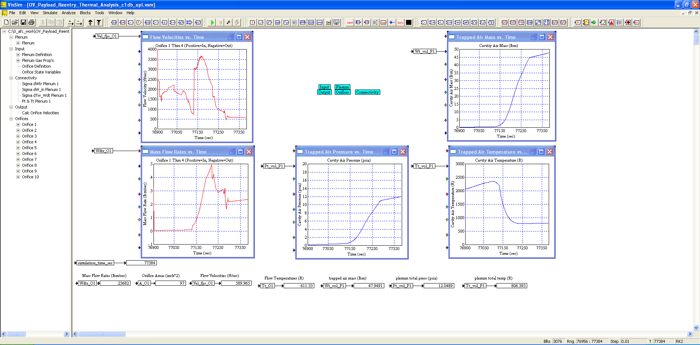
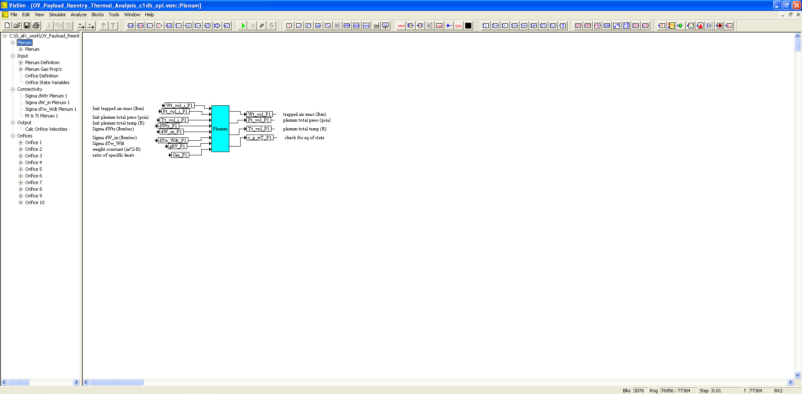
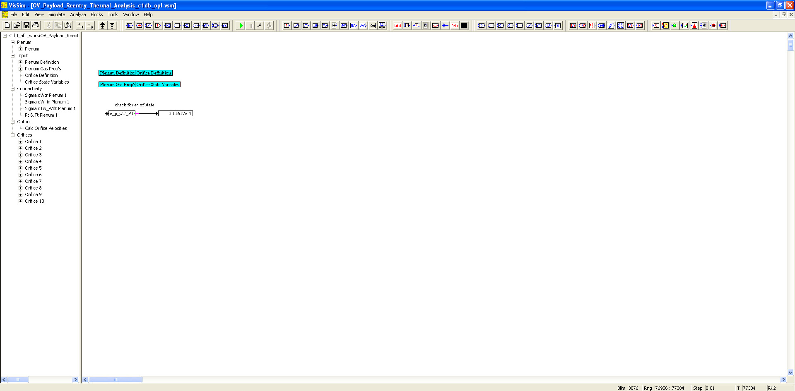
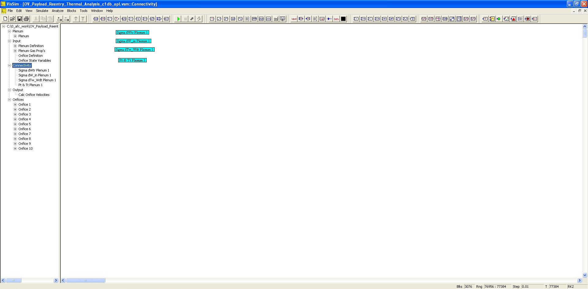
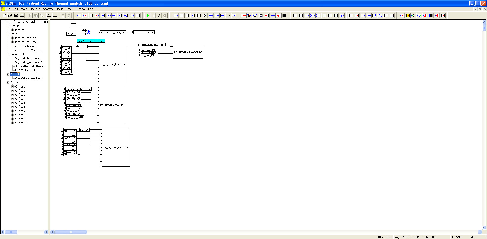
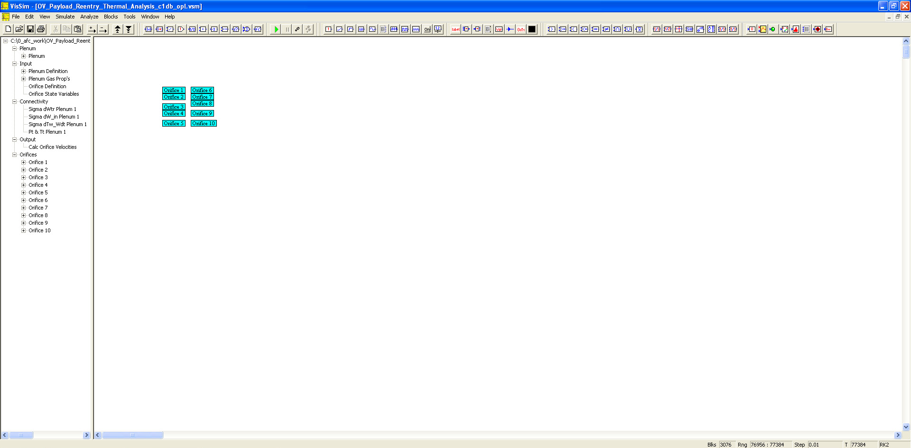

# ========================================
# Orbital Vehicle Payload Bay Reentry Venting/Thermal Analysis using VISSIM:
# ========================================

## Orbital Vehicle Payload Bay Reentry Venting/Thermal Analysis using VISSIM.

##
## I. Operation: "./VISSIM/OV_Payload_Reentry_Thermal_Analysis_c1db_opl.vsm"

##
## II. OV Payload Bay Reentry Venting Analysis Top Level Diagram:

##
## III. Plenum Sub-System Level Diagram:

##
## IV. Input Sub-System Level Diagram:

##
## V. Connectivity Sub-System Level Diagram:

##
## VI. Output Sub-System Level Diagram:

##
## VII. Orifices Sub-System Level Diagram:

##
#### XIIIa. Results: "./VISSIM/ov_payload_mdot.out"
#### XIIIb. Results: "./VISSIM/ov_payload_plenum.out"
#### XIIIc. Results: "./VISSIM/ov_payload_temp.out"
#### XIIId. Results: "./VISSIM/ov_payload_vel.out"

## 
## *Note: 
## 1. Performance Data and Analysis performed using VISSIM, ( https://web.solidthinking.com/vissim-is-now-solidthinking-embed )

